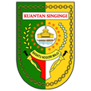

# PDF Kuansing

<div align="center">
  
  <h1>Perangkat PDF Aparatur</h1>
  <p>
    <strong>Aman, Privat & Berbasis Peramban</strong>
  </p>
  <p>
    Perangkat pengolah PDF untuk kebutuhan Aparatur Sipil Negara Kabupaten Kuantan Singingi.
    Semua proses berjalan sepenuhnya di perangkat lokal tanpa mengunggah ke server.
  </p>
</div>

<div align="center">


</div>

---

## 📖 Tentang

**PDF Kuansing** adalah perangkat pengolah PDF berbasis peramban yang dikembangkan untuk mendukung kebutuhan Aparatur Sipil Negara (ASN) di **Kabupaten Kuantan Singingi**. Aplikasi ini merupakan modifikasi dari proyek [PDFCraft](https://github.com/PDFCraftTool/pdfcraft) yang telah direbrand dan disesuaikan untuk lingkungan pemerintahan.

Berbeda dengan banyak konverter online, PDF Kuansing memproses file Anda sepenuhnya di dalam peramban menggunakan teknologi WebAssembly. Dokumen Anda **tidak pernah** meninggalkan perangkat, menjamin keamanan maksimal untuk data sensitif.

## ⚖️ Lisensi & Kepatuhan

Proyek ini dilisensikan di bawah **GNU Affero General Public License v3.0 (AGPL-3.0)**.

Ini merupakan **versi modifikasi** dari PDFCraft (https://github.com/PDFCraftTool/pdfcraft).
Sesuai dengan ketentuan AGPL-3.0 Section 13, kode sumber lengkap dari versi modifikasi ini tersedia secara publik di:

**https://github.com/Masriadi/pdf-kuansing**

Untuk detail modifikasi yang dilakukan, lihat file [MODIFICATIONS.md](MODIFICATIONS.md).

## ✨ Fitur Utama

- **🔒 100% Privat**: Semua pemrosesan terjadi di sisi klien. Tidak ada unggahan file ke server eksternal.
- **🚀 Cepat & Responsif**: Didukung oleh Next.js dan WebAssembly untuk performa mendekati native.
- **🛠️ Perangkat Lengkap**: Lebih dari 80+ alat untuk menangani berbagai tugas PDF.
- **🎨 UI Modern**: Desain bersih, aksesibel, dan responsif dengan Tailwind CSS.
- **🌐 Multi-bahasa**: Mendukung bahasa Indonesia, Inggris, dan berbagai bahasa lainnya.

## 🔄 Editor Alur Kerja (Beta)

> ⚠️ **Pemberitahuan Pengembangan Awal**: Fitur ini masih dalam tahap pengembangan awal. Anda mungkin menemukan bug atau fungsionalitas yang belum lengkap.

PDF Kuansing menyertakan **editor alur kerja visual** yang memungkinkan Anda merangkai beberapa operasi PDF secara bersamaan, menciptakan pipeline pemrosesan otomatis.

## 🚀 Panduan Deployment

### Prasyarat

- Node.js 22+
- npm atau yarn

### Instalasi Lokal

1. **Clone repository**
   ```bash
   git clone https://github.com/Masriadi/pdf-kuansing.git
   cd pdf-kuansing
   ```

2. **Instal dependensi**
   ```bash
   npm install
   ```

3. **Jalankan server pengembangan**
   ```bash
   npm run dev
   ```

4. **Buka di browser**
   Buka [http://localhost:3000](http://localhost:3000)

### Build untuk Production

```bash
npm run build
```

Output akan berada di folder `out/`, siap untuk dideploy sebagai situs statis.

### 🐳 Docker

```bash
# Build image
docker build -t pdf-kuansing .

# Jalankan container
docker run -d -p 8080:80 --name pdf-kuansing pdf-kuansing
```

Atau gunakan Docker Compose:

```bash
docker compose --profile prod up
```

### Deployment dengan Subpath

PDF Kuansing mendukung deployment di bawah subpath (misalnya `https://domain-anda.go.id/pdf-kuansing/`):

```bash
docker build --build-arg BASE_PATH=/pdf-kuansing -t pdf-kuansing .
```

## 📖 Dokumentasi Deployment

Untuk instruksi deployment yang lebih komprehensif, lihat [DEPLOYMENT.md](DEPLOYMENT.md).

## 🤝 Penghargaan

PDF Kuansing berdiri di atas pundak raksasa. Kami mengucapkan terima kasih kepada:

- **[PDFCraft](https://github.com/PDFCraftTool/pdfcraft)** — Proyek asli yang menjadi fondasi aplikasi ini.
- **[BentoPDF](https://github.com/alam00000/bentopdf)** — Inspirasi untuk pendekatan pemrosesan PDF yang berfokus pada privasi di sisi klien.

## 📄 Lisensi

Proyek ini dilisensikan di bawah [GNU Affero General Public License v3.0](LICENSE).

Kode sumber asli PDFCraft dilisensikan di bawah AGPL-3.0 oleh PDFCraft Team.

Modifikasi ini dilakukan oleh **Dinas Komunikasi dan Informatika Kabupaten Kuantan Singingi**.

---

<div align="center">
  Dibangun untuk ASN Kabupaten Kuantan Singingi
</div>
